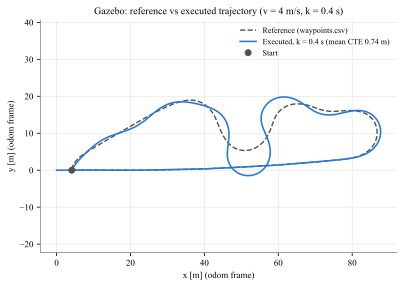

# Pure Pursuit Controller in ROS 2 (M4 Activity 2)

Path tracking for the Toyota Prius model in Gazebo with ROS 2.
Course: Movilidad Inteligente (MR3004C.601), Tecnológico de Monterrey, Campus Puebla.
Professor: Arturo Daniel Sosa Cerón.



The package `pure_pursuit_controller` contains:

| File | What it does |
|---|---|
| `path_recorder.py` | Subscribes to `/odom`, stores (x, y) when the car moved more than `min_distance`, writes a CSV on Ctrl+C |
| `pure_pursuit_node.py` | Subscribes to `/odom`, runs Pure Pursuit in a 20 Hz timer, publishes `/cmd_vel` |
| `pure_pursuit_core.py` | ROS free math: quaternion to yaw, look-ahead search, steering law, bicycle mapping |
| `launch/record_path.launch.py` | Simulation + recorder (step 1) |
| `launch/pure_pursuit.launch.py` | Simulation + controller + trajectory logger (steps 2 and 3) |
| `config/pure_pursuit.yaml` | All tunable parameters |
| `scripts/analyze_tracking.py` | Cross-track error metrics and overlay plots |
| `scripts/offline_sim.py` | Kinematic bicycle simulation to test the controller without Gazebo |

## Vehicle model

The controller uses a kinematic bicycle model referenced to the rear axle. The parameters are
taken from the `gz::sim::systems::AckermannSteering` plugin in
`prius_bringup/models/prius_hybrid/model.sdf`:

| Parameter | Value | SDF tag |
|---|---|---|
| Wheelbase L | 2.7 m | `<wheel_base>` |
| Steering limit | 0.5 rad | `<steering_limit>` |
| Wheel radius | 0.31265 m | `<wheel_radius>` |
| Wheel separation | 1.572 m | `<wheel_separation>` |
| Kingpin width | 1.530 m | `<kingpin_width>` |

Odometry comes from the same plugin (`/model/prius_hybrid/odometry`, bridged to `/odom`,
50 Hz in simulation time, frame `prius_hybrid/odom`, x forward at spawn, yaw CCW).

## Control law

```
Ld    = Ld_min + k * v                 (speed adaptive look-ahead, clipped to Ld_max)
alpha = atan2(y_t - y, x_t - x) - yaw  (yaw from the /odom quaternion)
delta = atan(2 L sin(alpha) / Ld)      (clipped to the Prius steering limit, 0.5 rad)
omega = v tan(delta) / L               (kinematic bicycle, sent as angular.z)
```

The AckermannSteering plugin converts `angular.z` back to a steering angle with the same L,
so the commanded delta is what reaches the front wheels.

## Requirements

* Ubuntu 26.04, ROS 2 Lyrical, Gazebo Sim 10, `ros_gz`
* `sudo apt install ros-lyrical-ros-gz ros-lyrical-teleop-twist-keyboard python3-matplotlib python3-numpy`
* `prius_bringup` from the course repository
  [dsosa114/movilidad_inteligente](https://github.com/dsosa114/movilidad_inteligente) (Apache 2.0).
  It is not included here; copy it into `src/` as shown below.

## Build

This repository is a complete workspace (`src/` inside).

```bash
git clone https://github.com/Gabrysaid/pure_pursuit_ws ~/Workspace/pure_pursuit_ws
git clone https://github.com/dsosa114/movilidad_inteligente /tmp/movilidad_inteligente
cp -r /tmp/movilidad_inteligente/prius_bringup ~/Workspace/pure_pursuit_ws/src/
cd ~/Workspace/pure_pursuit_ws
source /opt/ros/lyrical/setup.bash
colcon build --symlink-install
source install/setup.bash
```

With CMake 4 the upstream `prius_bringup` prints a deprecation warning for
`cmake_minimum_required(VERSION 3.8)`; changing it to `3.10` removes it.

## 1. Record the reference path

```bash
# terminal 1
ros2 launch pure_pursuit_controller record_path.launch.py
# terminal 2: drive a closed loop with turns, end near the start
ros2 run teleop_twist_keyboard teleop_twist_keyboard --ros-args -p speed:=2.0 -p turn:=0.2
# back in terminal 1: Ctrl+C  ->  ~/pp_data/waypoints.csv
```

## 2. Track it autonomously

Restart the simulation first so the odometry starts again at the spawn pose.

```bash
ros2 launch pure_pursuit_controller pure_pursuit.launch.py run_tag:=main
# the car drives one lap and stops; Ctrl+C writes ~/pp_data/actual_trajectory_main.csv
```

Launch arguments: `target_speed:=4.0 lookahead_min:=3.0 lookahead_gain:=0.4 run_tag:=k04`.
Parameters can also be changed live:

```bash
ros2 param set /pure_pursuit_node lookahead_gain 0.8
ros2 topic echo /pure_pursuit_node/cross_track_error
```

## 3. Evaluate

```bash
python3 src/pure_pursuit_controller/scripts/analyze_tracking.py \
  --ref ~/pp_data/waypoints.csv \
  --run "k = 0.4 s" ~/pp_data/actual_trajectory_main.csv --out ~/pp_data/results
```

Look-ahead gain sweep (one Gazebo run per value, restarting the simulation each time):

```bash
for k in 00 02 08 12; do
  ros2 launch pure_pursuit_controller pure_pursuit.launch.py lookahead_gain:=${k:0:1}.${k:1} run_tag:=k$k
done
python3 src/pure_pursuit_controller/scripts/analyze_tracking.py --ref ~/pp_data/waypoints.csv \
  --run "k=0.0" ~/pp_data/actual_trajectory_k00.csv --run "k=0.2" ~/pp_data/actual_trajectory_k02.csv \
  --run "k=0.4" ~/pp_data/actual_trajectory_main.csv --run "k=0.8" ~/pp_data/actual_trajectory_k08.csv \
  --run "k=1.2" ~/pp_data/actual_trajectory_k12.csv \
  --sweep-values 0 0.2 0.4 0.8 1.2 --out ~/pp_data/results_sweep
```

Outputs: `overlay.svg/pdf`, `error_profile.svg/pdf`, `sweep.svg/pdf` (vector) and `metrics.json`
(mean, RMS, 95th percentile and max cross-track error, split into straights and curves).
The Gazebo results used in the report are in `results/gazebo/`.

## Tests

```bash
python3 -m pytest src/pure_pursuit_controller/test
flake8 src/pure_pursuit_controller
```

## Report

```bash
python3 report/make_report.py --gazebo ~/pp_data/results --gazebo-sweep ~/pp_data/results_sweep
```

`report/report.pdf` is the submitted report.
